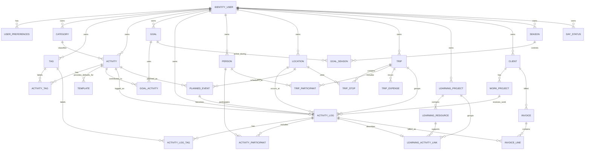

# Life Tempo
## Version 3 — Philosophy, Functional Design, Conceptual Model, and MySQL Implementation Specification

> Formerly titled "Retirement Engagement App." Renamed **Life Tempo** on 2026-09-20.
> This document is the full product/architecture spec, carried into the repo so
> later phases have it on hand without depending on chat history.

**Status:** Development-ready working specification
**Purpose:** Define the philosophy, functional behavior, conceptual model, and concrete MySQL implementation structure for development.

---

# 1. Purpose of the App

The purpose of this app is to help a retired person stay intentionally engaged in life.

The app is not meant to become another job, a rigid task manager, or a source of guilt. Its purpose is to answer a broader question:

> **Am I living the retirement I intended to live?**

Retirement should include structure, purpose, service, health, learning, relationships, enjoyment, rest, and flexibility. The app should help the user see whether those parts of life are staying in reasonable balance over time.

The app should support both recurring routines and spontaneous activity.

Examples include:

- Exercise
- Temple attendance
- Music practice
- Community music rehearsals and performances
- Ministering and church service
- Productive work around the home
- Shared activities with a spouse
- Yard work
- Learning
- Applying newly learned skills
- Travel
- Temple trips
- Family activities
- Social activities
- Volunteer service
- Paid contract work
- Leisure and recreation

The system should allow users to define additional activities that matter to them.

---

# 2. Core Philosophy

## 2.1 Engagement, not perfection

The app should measure engagement rather than perfection.

The user does not expect every goal to be completed every week. A healthy target is generally:

- **70% to 100% = acceptable overall engagement**
- A single low week should not be treated as failure.
- Rolling averages, monthly views, and quarterly views are more meaningful than isolated weeks.

The app should help the user notice patterns rather than punish missed checkboxes.

---

## 2.2 Retirement should not become another full-time job

The app should provide enough structure to encourage purposeful activity while preserving flexibility.

It should not create the feeling of:

> "I have 37 tasks due this week."

Instead, it should distinguish among different types of commitments.

Examples:

- **Rhythm:** Exercise five times per week
- **Commitment:** Concert rehearsal Wednesday at 7:00 PM
- **Intention:** Visit a temple sometime this month
- **Event:** Wife's performance Tuesday at 2:00 PM
- **Opportunity:** Visit someone who may need support
- **Record only:** A spontaneous family outing

Not everything should behave like a task.

---

## 2.3 Balance matters more than raw totals

One activity should not be able to compensate completely for neglecting another.

For example, exercising ten times in one week should not make the overall engagement score look excellent if spiritual activity, shared time with a spouse, learning, or music were ignored.

The overall engagement model should therefore be based on meaningful life dimensions or goals, not simply on raw activity counts.

---

## 2.4 The app should support real life

Life includes:

- Travel
- Illness
- Family events
- Performance seasons
- Holidays
- Rest days
- Busy weeks
- Weather interruptions
- Unexpected obligations

The app should support exclusions, adjusted expectations, seasonal goals, and flexible cadence.

Its purpose is to reflect real life, not force life to conform to the app.

---

# 3. Major Life Dimensions

The app should support broad life dimensions that can be used for reporting, heat maps, and engagement scoring.

Suggested dimensions include:

- Health
- Spiritual
- Music
- Shared Life / Spouse
- Family
- Service
- Learning
- Productive Home Activity
- Social
- Travel
- Recreation
- Paid Work
- Leisure / Rest

Users should be able to add or rename categories.

One activity may contribute to more than one dimension.

Examples:

### Yard work with spouse
- Productive
- Physical
- Shared Life
- Outdoor

### Temple trip with spouse
- Spiritual
- Shared Life
- Travel

### Photography practice after taking a course
- Learning
- Application
- Recreation

### Attending spouse's performance
- Shared Life
- Music
- Social

The app should therefore support both a primary category and multiple tags or dimensions.

---

# 4. User Ownership and Privacy

The app should support multiple users.

The existing identity/login table already provides a unique user ID tied to email login.

That existing user ID should be used as the ownership key throughout the retirement app.

Most user-specific records should include:

`UserID`

Examples include:

- Activities
- Activity logs
- Goals
- Locations
- People
- Trips
- Learning projects
- Templates
- Notes
- Calendar-related records

Privacy should be the default.

A user's records should not be visible to another user unless they are explicitly shared.

Every query involving personal information should be scoped to the authenticated `UserID`.

---

# 5. Activities

An Activity represents something the user may do repeatedly or track over time.

Examples:

- Exercise
- Temple Visit
- Instrument Practice
- Ministering
- Church Service
- Yard Work
- Learning
- Photography Practice
- Concert Band Rehearsal
- Christmas Choir
- Family Band Practice
- Attend Spouse's Performance
- Contract Work

Activities should be user-defined rather than hard-coded.

Suggested activity properties include:

- Activity name
- UserID
- Primary category
- Tags
- Typical duration
- Active/inactive status
- Productive flag
- Billable eligible flag
- Calendar-related flag
- Location-related flag
- Default location
- Default cadence
- Seasonal availability
- Whether activity counts toward engagement scoring
- Whether activity may be quick-logged

---

# 6. Activity Logging

The most important interaction in the app should be very easy:

> **Log that I did something.**

A standard log entry should support:

- Activity
- Date
- Start time
- End time
- Calculated duration
- Location
- Notes
- People involved
- Tags
- Productive flag when applicable
- Billable flag when applicable
- Cost when applicable
- Associated trip
- Associated calendar event
- Associated learning project

The app should calculate elapsed time automatically when start and end times are provided.

---

# 7. Quick Log

Frequently repeated activities should be recordable with very few taps.

Example:

> Exercise ✓

A Quick Log could assume:

- Today's date
- Current user
- Default activity
- Typical duration
- Default category and tags

The user should still be able to edit the entry afterward.

Favorites or Quick Add buttons should be available for common activities such as:

- Exercise
- Instrument Practice
- Temple
- Ministering
- Yard Work
- Learning
- Contract Work

---

# 8. Goals and Cadence

Some activities should have expected cadence.

Examples:

- Exercise — 5 times per week
- Temple — 1 day per week
- Instrument Practice — daily
- Ministering — weekly, preferably Tuesday
- Productive Activity — once per applicable home day
- Church Service — Sunday
- Shared meaningful activity with spouse — recurring
- Learning — recurring

Goals should support:

- Daily
- Weekly
- Monthly
- Quarterly
- Annual
- Custom cadence

Goals should also support different goal types:

- Minimum
- Target
- Maximum
- Track only
- Optional

Examples:

### Minimum
Temple at least once per week.

### Target
Exercise five times per week.

### Maximum
Paid contract work should remain below a desired amount.

### Track only
Attend spouse's performance whenever one occurs.

---

# 9. Goal Weighting

Not all goals are equally important.

The app should allow goals or life dimensions to have different importance levels or weights.

Core retirement rhythms may include:

- Health
- Spiritual activity
- Music
- Shared life with spouse
- Learning
- Service
- Productive activity

Optional activities should not distort the engagement score.

Weighting should remain understandable and transparent.

---

# 10. Engagement Score

The overall engagement score should help answer:

> **Am I staying engaged with the life I intended to live?**

The score should not simply total completed activities.

It should evaluate performance against selected goals and dimensions.

The user expects approximately:

- **90–100% — Strongly engaged**
- **70–89% — On track**
- **50–69% — Worth noticing**
- **Below 50% — Something may be crowding life out**

These labels should remain configurable.

The app should not shame the user for low scores.

---

# 11. Scoring Rules

Important principles:

1. Individual goals may cap at 100% for overall scoring.
2. Excess activity in one category should not erase neglect in another.
3. Activities excluded from scoring should remain visible but should not affect the score.
4. Travel, illness, and other exceptions should be adjustable.
5. The user should be able to inspect how the score was calculated.
6. Rolling periods should matter more than a single week.

Useful score views may include:

- Current week
- Rolling 4 weeks
- Month
- Quarter
- Year

---

# 12. Heat Map

The app should provide a visual heat map showing engagement over time.

Possible periods:

- Week
- Month
- Quarter
- Year

Possible dimensions:

- Health
- Spiritual
- Music
- Shared Life
- Learning
- Service
- Productive Activity
- Social
- Travel
- Paid Work
- Overall Engagement

Example structure:

| Week | Health | Spiritual | Music | Shared Life | Learning | Service | Productive | Overall |
|---|---:|---:|---:|---:|---:|---:|---:|---:|
| Nov 2 | 80% | 100% | 86% | 100% | 75% | 100% | 83% | 89% |
| Nov 9 | 100% | 100% | 100% | 80% | 40% | 100% | 75% | 85% |

The heat map should help reveal long-term patterns rather than merely summarize checkboxes.

---

# 13. Home Days and Daily Productivity

The user wants to do something productive every day they are home.

A day should therefore optionally have a day-status classification such as:

- Home
- Local Outing
- Travel
- Vacation
- Sick / Recovery
- Special Event

The daily productive-activity goal should only apply to appropriate days.

Examples of productive activity may include:

- Yard work
- Home repair
- Organizing
- Music preparation
- Learning application
- Trip planning
- Helping someone
- Contract work
- Completing a household task

The app should not treat travel or legitimate rest days as failures.

---

# 14. Spiritual and Service Rhythm

The retirement plan includes strong spiritual and service components.

Examples:

- Sunday reserved for church service
- Temple attendance at least one day per week
- Optional additional local temple visits
- Ministering preferably every Tuesday
- If no assigned-family visit is needed, Tuesday may be used to visit or support others

These should be represented as recurring rhythms rather than rigid appointments.

---

# 15. Music

Music is a major recurring retirement activity.

The app should support:

- Daily instrument practice
- Practice with family members
- Family band activity
- Community Christmas music program
- Community concert band
- Pops concert rehearsals and performances
- Performance preparation
- Attending spouse's musical performances

Music commitments vary seasonally.

The app should support seasonal activities and recurring rehearsal patterns.

---

# 16. Shared Life With Spouse

Retirement is a shared life change.

The app should intentionally recognize meaningful shared activities with the user's spouse.

Examples:

- Temple visits
- Temple trips
- Yard work
- Meals
- Day trips
- Travel
- Concerts
- Family events
- Attending spouse's performances
- Home projects
- Recreation

The app should distinguish between:

- A spouse simply being present
- An activity being intentionally done together

Shared Life should be a first-class reporting dimension.

---

# 17. People and Participation

The app should support people connected to activities.

This is not intended to replace a contact manager.

Possible people include:

- Spouse
- Children
- Grandchildren
- Friends
- Ministering families
- Family band members

An activity log may include one or more participants.

Future multi-user participation should be supported.

For example, one temple visit could be recorded once and count toward both spouses' records if both use the app.

Ownership and participation should remain separate concepts.

---

# 18. Learning

Continued learning is a major retirement goal.

Learning may include:

- LinkedIn Learning courses
- Books
- Tutorials
- Videos
- Classes
- Self-directed research
- Practical experimentation

The app should distinguish between:

### Learn
Consuming instruction or information.

### Apply
Practicing or using the new knowledge.

Example:

**Photography**
- 5 hours of course instruction
- 2 hours of camera practice
- 3-hour photo walk
- 1.5 hours of editing practice

This distinction helps answer not only:

> What did I learn?

but also:

> Did I do anything with what I learned?

---

# 19. Learning Projects

Related learning activities should be grouped into projects or topics.

Examples:

- Photography
- Genealogy
- 3D Printing
- Cooking
- Astronomy
- Artificial Intelligence
- Music Theory

A learning project may contain:

- Title
- Description
- Start date
- Status
- Instruction hours
- Application hours
- Notes
- Resources

This supports the user's tendency to pursue interesting "rabbit holes" without losing track of them.

---

# 20. Planned Activities vs. Completed Activities

The system should distinguish between:

- Planned
- Scheduled
- Completed
- Cancelled
- Skipped
- Recorded after the fact

Not everything needs to be planned.

Spontaneous activities should be easy to log.

Planned activities should appear in an Upcoming view.

---

# 21. Calendar Integration

Calendar integration should be part of the design even if full synchronization is not implemented initially.

Useful actions include:

- Add activity to calendar
- Add trip event to calendar
- Add rehearsal or performance
- Open existing calendar event
- Mark a calendar event as attended/completed

Calendar-related records may contain:

- Start date/time
- End date/time
- Location
- Notes
- External calendar link or identifier

The system should avoid requiring duplicate data entry whenever possible.

---

# 22. Locations

Locations should be reusable objects.

A location may include:

- Name
- Address
- City
- State
- ZIP
- Phone
- Website
- Notes
- Latitude
- Longitude
- Typical travel time
- Typical visit duration
- Parking notes
- Category

Examples:

- Temple
- Gym
- Church
- Assisted living facility
- Rehearsal hall
- Concert venue
- Park
- Restaurant
- Hotel

Useful actions:

- Navigate
- Open map
- Add to calendar
- Open website

---

# 23. Temple Travel

Visiting temples should be supported as both a spiritual activity and a travel project.

The app should help track:

- Temples visited
- Temples not yet visited
- Visit dates
- Time spent
- Driving distance
- Travel cost
- Lodging
- Trip grouping
- Notes

Local visits may be half-day activities.

More distant visits may involve:

- Day trips
- Overnight stays
- Multiple temples per trip

The design should support future economical trip planning.

---

# 24. Trips

Trips should be first-class objects.

A trip may include:

- Trip title
- UserID
- Start date
- End date
- Participants
- Purpose
- Estimated miles
- Actual miles
- Estimated cost
- Actual cost
- Lodging
- Notes

A trip may contain multiple stops.

Examples:

- Temple
- Hotel
- Restaurant
- Scenic stop
- Family visit

---

# 25. Trip Stops

A Trip Stop may include:

- Trip
- Sequence
- Location
- Planned arrival
- Planned departure
- Actual arrival
- Actual departure
- Activity
- Cost
- Notes

This enables future route planning and temple-loop planning.

---

# 26. Cost Tracking

Cost should be optional but supported.

Examples:

- Gas
- Lodging
- Meals
- Admission
- Supplies
- Equipment
- Recreation

Cost tracking should help answer questions such as:

- How much did we spend on recreation this quarter?
- How much did temple travel cost?
- Which activities are inexpensive but rewarding?
- How much did travel cost this year?

The app should not require cost entry for every activity.

---

# 27. Paid Contract Work

Some retirement work for the user's former employer may continue as billable independent-contractor work.

The app should support:

- Activity type
- Client
- Project
- Date
- Start time
- End time
- Duration
- Billable flag
- Billable rate if desired
- Description
- Mileage or expense
- Invoice status
- Payment status

Contract work should be treated as something to control, not necessarily something to maximize.

Possible future reporting:

- Billable hours this week
- Billable hours this month
- Contract work as percentage of total engaged time
- Unbilled work
- Invoiced amount
- Paid amount

---

# 28. Seasons

Activities may vary during the year.

Examples:

- Christmas choir season
- Community concert band season
- Pops season
- Travel season
- Yard season

The app should support date-based or named seasons.

A season may activate or deactivate particular goals and activities automatically.

This prevents the user from having to rebuild goals several times per year.

---

# 29. Templates

The app should support reusable activity templates.

Examples:

- Temple Visit
- Instrument Practice
- Concert Band Rehearsal
- Ministering
- Gym
- Walk
- Yard Work with Spouse
- LinkedIn Learning
- Learning Application
- Attend Spouse's Performance
- Contract Work

Templates may pre-fill:

- Category
- Tags
- Typical duration
- Default location
- Billable eligibility
- Productive flag
- Goal relationship
- Calendar behavior

---

# 30. Notes and Reflection

Each activity may optionally include a short note or reflection.

Examples:

- Great day
- Would do this again
- Too strenuous
- Photography technique finally clicked
- Good visit
- Need to bring different equipment next time

Over time, this may create a lightweight retirement journal.

Reflection should remain optional.

---

# 31. Exceptions and Adjustments

The user should be able to adjust expectations without rewriting goals.

Examples:

- Vacation
- Travel
- Illness
- Recovery
- Family emergency
- Performance week
- Holiday

Possible actions:

- Exclude day
- Exclude week
- Reduce goal temporarily
- Pause activity
- Apply seasonal schedule

Adjusted periods should remain visible in reports.

---

# 32. Today Screen

The primary screen should be simple.

Example:

## Today

### Today's plans
- Church
- Practice instrument
- Family dinner

### Weekly progress
- Exercise 3 / 5
- Temple 1 / 1
- Practice 6 / 7
- Ministering complete
- Productive home days 3 / 3

### Coming up
- Tuesday — Ministering
- Wednesday — Spouse's performance
- Thursday — Concert band rehearsal
- Saturday — Temple outing

Primary action:

> **+ Log Activity**

---

# 33. Weekly Review

A weekly review should summarize activity without becoming judgmental.

Possible information:

- Goals met
- Goals partially met
- Time spent by life dimension
- Shared-life time
- Learning vs. application
- Billable work
- Cost
- Upcoming commitments
- Rolling engagement score

The user should be able to add a short weekly reflection if desired.

---

# 34. Monthly and Quarterly Review

Longer-term views should help answer:

- Where is my retirement time going?
- Am I staying engaged?
- Am I doing enough with my spouse?
- Am I learning and applying?
- Is paid work starting to consume too much time?
- Am I maintaining spiritual activity?
- Am I exercising consistently?
- Is one area crowding out another?

Quarterly trends are more important than perfect individual weeks.

---

# 35. Time by Life Category

The app should summarize time across major categories.

Example:

- Music — 31 hours
- Exercise — 23 hours
- Spiritual — 18 hours
- Family / Social — 26 hours
- Projects — 17 hours
- Learning — 14 hours
- Paid Work — 6 hours

This view answers:

> **Where is my retirement actually going?**

---

# 36. Transparency

Scores and summaries should be explainable.

If the app displays:

> Overall Engagement: 84%

the user should be able to inspect:

- Which goals contributed
- What the expected cadence was
- What was completed
- What was excluded
- What weighting was used

No mysterious black-box scoring.

---

# 37. Data Portability

The user's activity history may become personally valuable over time.

The app should eventually support export to common formats such as:

- CSV
- JSON
- Printable summary
- Backup file

The user should not be permanently locked into one implementation of the app.

---

# 38. Design Principles

The application should be:

- Simple to log into
- Fast to record an activity
- Flexible
- Encouraging
- Transparent
- Multi-user
- Private by default
- Calendar-aware
- Location-aware
- Useful for both recurring routines and spontaneous activities
- Suitable for long-term use
- Easy to extend

The app should avoid:

- Excessive mandatory fields
- Punitive reminders
- Overly rigid schedules
- Treating retirement like employment
- Requiring everything to be categorized perfectly
- Hiding how engagement scores are calculated

---

# 39. Initial Retirement Rhythms

The initial retirement setup includes:

### Health
- Exercise approximately 5 days per week
- Walking, gym, Zumba, or similar activity

### Spiritual
- Temple attendance at least 1 day per week
- Optional additional local visit
- Sunday reserved for church service
- Ministering preferably on Tuesday

### Music
- Practice instrument every day
- Practice with family when available
- Family band
- Seasonal community music participation
- Concert band
- Christmas choir
- Pops program

### Shared Life
- Meaningful activities with spouse
- Yard work together
- Temple attendance and temple trips
- Attend spouse's performances
- Travel and outings together

### Learning
- Continued lifelong learning
- LinkedIn Learning
- Self-directed study
- Practical application of learning

### Productive Home Life
- Do something productive on each applicable home day

### Paid Work
- Limited billable contract work when necessary
- Track time carefully
- Protect retirement from being overtaken by work

---

# 40. Design Phases

## Version 1
**Philosophy + Functional Design**

Completed.

## Version 2
**Conceptual Data Model**

Completed.

## Version 3
**Detailed MySQL Database and Implementation Specification**

Completed in this document.

## Version 4
**SQL DDL + API / Page Contract**

Optional next step.

Add:

- Fields
- Data types
- Keys
- Foreign keys
- Indexes
- Unique constraints
- Status values
- Lookup tables
- Suggested naming conventions
- Migration considerations

Programming decisions should follow these design phases rather than lead them.

---

# 41. Guiding Question

The application should always remain centered on one question:

> **Am I intentionally spending my retirement time on the people, activities, service, learning, health, and experiences that matter to me?**


---

# 42. Version 2 — Conceptual Data Model

## 42.1 Purpose of Version 2

Version 2 adds the conceptual data model for a MySQL implementation.

This section defines:

- Major entities
- Ownership rules
- Relationships
- Shared-data concepts
- Reporting structure
- Suggested separation of concerns
- Conceptual ERD

It intentionally does **not** yet define exact MySQL data types, indexes, DDL, or migration scripts. Those belong in Version 3.

---

# 43. Existing Identity System

The application already has an identity/login table that assigns each authenticated user a unique user ID tied to email login.

That existing identity table should remain the authoritative source for login identity.

The retirement app should **not** create a competing user table.

Instead, app-owned tables should reference:

`UserID`

`UserID` is the tenant/owner key for private retirement data.

Conceptual rule:

> Every private record belongs to a specific authenticated user unless explicitly designed as a shared record.

---

# 44. Core Ownership Rule

Most primary tables should include `UserID`.

Examples:

- Activity
- Goal
- ActivityLog
- DayStatus
- Location
- Person
- Trip
- LearningProject
- Season
- Template
- Note
- CalendarLink

This makes each user's data logically separate even when multiple users use the same application.

For example:

- Dennis may have an activity called Exercise.
- Elaine may also have an activity called Exercise.
- These remain independent records.

Logical uniqueness should generally be scoped by user.

Example:

`UserID + ActivityName`

rather than requiring `ActivityName` to be globally unique.

---

# 45. Core Entity Groups

The conceptual model is easier to understand when divided into functional groups.

## 45.1 Identity and ownership

- Existing Identity Table
- UserPreferences

## 45.2 Activity definition

- Activity
- Category
- Tag
- ActivityTag
- Template

## 45.3 Expectations and cadence

- Goal
- GoalActivity
- Season
- GoalSeason
- ExceptionPeriod

## 45.4 Actual activity history

- ActivityLog
- ActivityLogTag
- ActivityParticipant
- DayStatus
- Reflection

## 45.5 People and shared life

- Person
- UserRelationship
- SharedActivityLink

## 45.6 Place and navigation

- Location

## 45.7 Calendar and planning

- PlannedEvent
- CalendarLink

## 45.8 Trips

- Trip
- TripParticipant
- TripStop
- TripExpense

## 45.9 Learning

- LearningProject
- LearningResource
- LearningActivityLink

## 45.10 Billable work

- Client
- WorkProject
- Invoice
- InvoiceLine

## 45.11 Reporting and engagement

- EngagementPeriod
- EngagementSnapshot

These reporting tables are optional because some results may instead be calculated dynamically.

---

# 46. UserPreferences

`UserPreferences` stores app behavior specific to each user.

Examples:

- Preferred navigation app
- Preferred calendar behavior
- First day of week
- Default engagement target minimum
- Default engagement target maximum
- Preferred time display
- Default quick-log behavior
- Whether costs are shown
- Whether billable features are enabled
- Whether reflections are enabled

Relationship:

**Existing Identity Table 1 → 0..1 UserPreferences**

---

# 47. Category

A Category represents a broad life area.

Examples:

- Health
- Spiritual
- Music
- Shared Life
- Family
- Service
- Learning
- Productive Home Activity
- Social
- Travel
- Recreation
- Paid Work
- Leisure

Categories may be:

- System-provided defaults
- User-created
- User-renamed
- Active/inactive

A category should conceptually contain:

- CategoryID
- UserID or system/global ownership indicator
- CategoryName
- Description
- ActiveFlag
- ReportingOrder

Relationship:

**User 1 → many Categories**

---

# 48. Tag

Tags allow an activity to participate in multiple ideas without forcing it into multiple primary categories.

Examples:

- Shared
- Physical
- Productive
- Outdoor
- Spiritual
- Travel
- Learning
- Application
- Social

Conceptual fields:

- TagID
- UserID
- TagName
- Description
- ActiveFlag

Relationship:

**User 1 → many Tags**

---

# 49. Activity

`Activity` is the reusable definition of something the user may do.

Examples:

- Exercise
- Temple Visit
- Instrument Practice
- Ministering
- Yard Work
- LinkedIn Learning
- Photography Practice
- Contract Work
- Attend DeciBelles Performance

Conceptual fields:

- ActivityID
- UserID
- ActivityName
- PrimaryCategoryID
- Description
- TypicalDuration
- ProductiveFlag
- BillableEligibleFlag
- CalendarRelatedFlag
- LocationRelatedFlag
- DefaultLocationID
- QuickLogFlag
- CountsTowardEngagementFlag
- ActiveFlag

Relationships:

**User 1 → many Activities**

**Category 1 → many Activities**

**Location 1 → many Activities as default location**

---

# 50. ActivityTag

`ActivityTag` is a bridge table between Activity and Tag.

Conceptual fields:

- ActivityID
- TagID

Relationship:

**Activity many ↔ many Tag**

This allows:

**Yard Work with Spouse**
- Primary Category: Productive Home Activity
- Tags: Shared, Physical, Outdoor

---

# 51. Template

A Template provides pre-filled defaults for rapid activity logging.

Examples:

- Gym
- Walk
- Temple Visit
- Instrument Practice
- Ministering
- Yard Work with Spouse
- LinkedIn Learning
- Contract Work

Conceptual fields:

- TemplateID
- UserID
- TemplateName
- ActivityID
- DefaultDuration
- DefaultLocationID
- DefaultProductiveFlag
- DefaultBillableFlag
- FavoriteFlag
- DisplayOrder
- ActiveFlag

Relationship:

**User 1 → many Templates**

**Activity 1 → many Templates**

A template may be more specific than an activity.

Example:

Activity = Exercise

Templates:
- Gym
- Walk
- Zumba

---

# 52. Goal

`Goal` represents an expectation, rhythm, limit, or tracking objective.

Examples:

- Exercise 5 times per week
- Temple at least once per week
- Practice instrument daily
- Ministering once per week
- Productive activity on each applicable home day
- Contract work no more than a selected amount
- Learning several times per week

Conceptual fields:

- GoalID
- UserID
- GoalName
- GoalType
- CadenceType
- TargetValue
- MinimumValue
- MaximumValue
- UnitType
- Weight
- CountsTowardOverallFlag
- StartDate
- EndDate
- ActiveFlag

Possible GoalType values:

- Minimum
- Target
- Maximum
- TrackOnly
- Optional

Possible UnitType values:

- Count
- Minutes
- Hours
- Days
- Percentage

---

# 53. GoalActivity

A Goal may be satisfied by one or more activities.

Example:

Goal:
**Exercise 5 times per week**

Qualifying Activities:
- Gym
- Walk
- Zumba
- Other Exercise

`GoalActivity` allows multiple activities to contribute to the same goal.

Conceptual fields:

- GoalID
- ActivityID
- ContributionRule
- ContributionWeight

Relationship:

**Goal many ↔ many Activity**

---

# 54. Season

`Season` allows activities and goals to vary through the year.

Examples:

- Christmas Choir Season
- Concert Band Season
- Pops Season
- Yard Season
- Travel Season

Conceptual fields:

- SeasonID
- UserID
- SeasonName
- StartRule or StartDate
- EndRule or EndDate
- RecursAnnuallyFlag
- ActiveFlag

Relationships:

**User 1 → many Seasons**

---

# 55. GoalSeason

A Goal may be active only during one or more seasons.

Example:

Goal:
**Attend concert band rehearsal**

Season:
**January through September**

Bridge fields:

- GoalID
- SeasonID

Relationship:

**Goal many ↔ many Season**

---

# 56. ExceptionPeriod

`ExceptionPeriod` represents a time when normal expectations should be changed or suspended.

Examples:

- Vacation
- Illness
- Recovery
- Family Emergency
- Performance Week
- Holiday Travel

Conceptual fields:

- ExceptionPeriodID
- UserID
- StartDate
- EndDate
- ExceptionType
- Description
- ExcludeFromScoringFlag
- AdjustmentRule

Relationship:

**User 1 → many ExceptionPeriods**

---

# 57. ActivityLog

`ActivityLog` is the central factual history table.

It records what actually happened.

Conceptual fields:

- ActivityLogID
- UserID
- ActivityID
- ActivityDate
- StartDateTime
- EndDateTime
- Duration
- LocationID
- ProductiveFlag
- BillableFlag
- Cost
- PlannedEventID
- TripID
- LearningProjectID
- WorkProjectID
- Notes
- CreatedDateTime

Relationship:

**User 1 → many ActivityLogs**

**Activity 1 → many ActivityLogs**

**Location 1 → many ActivityLogs**

This is expected to become one of the largest tables in the application.

---

# 58. ActivityLogTag

The actual logged activity may need tags different from the default activity definition.

Example:

A normal walk may be:

- Physical

But a walk with the user's spouse may additionally be:

- Shared

`ActivityLogTag` allows instance-specific classification.

Fields:

- ActivityLogID
- TagID

Relationship:

**ActivityLog many ↔ many Tag**

---

# 59. Person

`Person` represents someone connected to the user's retirement activity.

This is not intended to replace a full contact-management system.

Examples:

- Spouse
- Child
- Grandchild
- Friend
- Ministering family member
- Family band member

Conceptual fields:

- PersonID
- UserID
- DisplayName
- RelationshipType
- LinkedUserID if the person also uses the app
- Notes
- ActiveFlag

Important distinction:

`PersonID` is the user's personal relationship record.

`LinkedUserID` optionally points to another authenticated app user.

---

# 60. ActivityParticipant

`ActivityParticipant` connects people to completed activities.

Conceptual fields:

- ActivityLogID
- PersonID
- ParticipationType
- SharedLifeFlag

Examples of ParticipationType:

- Participated
- Attended
- PerformedWith
- Visited
- Supported
- Companion

Relationship:

**ActivityLog many ↔ many Person**

This allows an activity to intentionally count toward Shared Life when appropriate.

---

# 61. SharedActivityLink

This is an optional future feature for true multi-user shared activity.

Example:

Dennis and Elaine both use the app.

Dennis records one temple visit.

Instead of creating two unrelated records, the system could create a shared link so that both users may count the same real-world event toward their own goals.

Conceptual fields:

- SharedActivityLinkID
- SourceActivityLogID
- ParticipatingUserID
- ParticipationStatus
- CountTowardGoalsFlag

This feature should be designed for but does not need to be part of the first implementation.

---

# 62. DayStatus

`DayStatus` supports rules that depend on whether a day is actually a normal home day.

Examples:

- Home
- Local Outing
- Travel
- Vacation
- Sick
- Recovery
- Special Event

Conceptual fields:

- DayStatusID
- UserID
- CalendarDate
- DayType
- ProductiveGoalAppliesFlag
- Notes

Logical uniqueness:

`UserID + CalendarDate`

This table is particularly useful for evaluating:

> Do something productive on each applicable home day.

---

# 63. Reflection

A Reflection provides optional journaling without forcing long-form diary entries.

It may attach to:

- ActivityLog
- Day
- Week
- Month
- Quarter
- Trip
- LearningProject

Conceptual fields:

- ReflectionID
- UserID
- ReflectionType
- RelatedEntityType
- RelatedEntityID
- ReflectionDate
- Text

This may eventually support a lightweight personal retirement journal.

---

# 64. Location

`Location` stores reusable places.

Conceptual fields:

- LocationID
- UserID
- LocationName
- LocationType
- Address1
- Address2
- City
- State
- PostalCode
- Country
- Latitude
- Longitude
- Phone
- Website
- ParkingNotes
- TypicalDuration
- Notes
- ActiveFlag

Examples:

- Temple
- Gym
- Church
- Assisted Living Facility
- Rehearsal Hall
- Concert Venue
- Hotel
- Restaurant
- Park

A future design may support selected globally shared public locations, but private user locations should remain user-owned.

---

# 65. PlannedEvent

`PlannedEvent` represents something intended or scheduled before it occurs.

Examples:

- Concert rehearsal
- DeciBelles performance
- Temple outing
- Ministering visit
- Doctor appointment
- Planned yard project

Conceptual fields:

- PlannedEventID
- UserID
- ActivityID
- Title
- StartDateTime
- EndDateTime
- LocationID
- Status
- CalendarLinkID
- Notes

Possible Status values:

- Planned
- Scheduled
- Completed
- Cancelled
- Skipped

A completed PlannedEvent may link to an ActivityLog.

Relationship:

**PlannedEvent 0..1 → 1 ActivityLog**

---

# 66. CalendarLink

`CalendarLink` stores the connection between the retirement app and an external calendar event.

Conceptual fields:

- CalendarLinkID
- UserID
- Provider
- ExternalEventID
- CalendarName
- EventURL
- LastSyncDateTime
- SyncStatus

Calendar integration may be implemented later, but the model should leave room for it.

---

# 67. Trip

`Trip` represents multi-stop or travel-oriented activity.

Conceptual fields:

- TripID
- UserID
- TripName
- TripPurpose
- StartDate
- EndDate
- EstimatedMiles
- ActualMiles
- EstimatedCost
- ActualCost
- Notes
- Status

Examples:

- Cache Valley Temple Trip
- Southern Utah Temple Loop
- Family Visit
- Music Performance Trip

Relationships:

**User 1 → many Trips**

---

# 68. TripParticipant

`TripParticipant` connects people to trips.

Conceptual fields:

- TripID
- PersonID
- ParticipantRole

Relationship:

**Trip many ↔ many Person**

---

# 69. TripStop

`TripStop` defines ordered locations or activities within a trip.

Conceptual fields:

- TripStopID
- TripID
- StopSequence
- LocationID
- ActivityID
- PlannedArrival
- PlannedDeparture
- ActualArrival
- ActualDeparture
- Notes

Relationship:

**Trip 1 → many TripStops**

---

# 70. TripExpense

`TripExpense` records optional travel costs.

Conceptual fields:

- TripExpenseID
- TripID
- UserID
- ExpenseDate
- ExpenseType
- Amount
- Description

Possible ExpenseType values:

- Fuel
- Lodging
- Meals
- Admission
- Parking
- Supplies
- Other

Relationship:

**Trip 1 → many TripExpenses**

---

# 71. LearningProject

`LearningProject` groups related learning over time.

Examples:

- Photography
- Genealogy
- 3D Printing
- Artificial Intelligence
- Music Theory

Conceptual fields:

- LearningProjectID
- UserID
- ProjectName
- Description
- StartDate
- EndDate
- Status
- Notes

Relationship:

**User 1 → many LearningProjects**

---

# 72. LearningResource

`LearningResource` stores optional references to learning material.

Examples:

- LinkedIn Learning course
- Book
- Tutorial
- Video
- Website
- Class

Conceptual fields:

- LearningResourceID
- UserID
- LearningProjectID
- ResourceType
- Title
- Provider
- URL
- EstimatedDuration
- CompletionStatus
- Notes

Relationship:

**LearningProject 1 → many LearningResources**

---

# 73. LearningActivityLink

Actual learning activity should still be recorded in ActivityLog.

`LearningActivityLink` adds learning-specific meaning.

Conceptual fields:

- ActivityLogID
- LearningProjectID
- LearningMode
- LearningResourceID

Possible LearningMode values:

- Learn
- Apply
- Practice
- Research

This allows reporting such as:

- Photography instruction: 8 hours
- Photography application: 19.5 hours

---

# 74. Client

`Client` supports billable contract work.

Conceptual fields:

- ClientID
- UserID
- ClientName
- BillingNotes
- ActiveFlag

The user's former employer may be one Client.

Relationship:

**User 1 → many Clients**

---

# 75. WorkProject

`WorkProject` groups billable activity.

Conceptual fields:

- WorkProjectID
- UserID
- ClientID
- ProjectName
- BillingRate
- StartDate
- EndDate
- Status
- Notes

Relationship:

**Client 1 → many WorkProjects**

---

# 76. Invoice

Invoices are optional in the initial release but should be supported conceptually.

Conceptual fields:

- InvoiceID
- UserID
- ClientID
- InvoiceNumber
- InvoiceDate
- DueDate
- Status
- TotalAmount
- PaidDate
- Notes

Possible Status values:

- Draft
- Sent
- PartiallyPaid
- Paid
- Void

---

# 77. InvoiceLine

`InvoiceLine` connects billable work to an invoice.

Conceptual fields:

- InvoiceLineID
- InvoiceID
- ActivityLogID
- Description
- Quantity
- Rate
- Amount

A billable ActivityLog should not necessarily be considered invoiced merely because it exists.

This separation preserves proper work history.

---

# 78. EngagementPeriod

`EngagementPeriod` is an optional stored reporting period.

Possible periods:

- Week
- Month
- Quarter
- Year
- Rolling 4 Weeks

Conceptual fields:

- EngagementPeriodID
- UserID
- PeriodType
- StartDate
- EndDate

This may be generated dynamically rather than persisted.

---

# 79. EngagementSnapshot

`EngagementSnapshot` is optional and may be useful if engagement calculations become expensive or if historical scoring rules must be preserved.

Conceptual fields:

- EngagementSnapshotID
- UserID
- EngagementPeriodID
- CategoryID or GoalID
- ExpectedValue
- ActualValue
- Percentage
- WeightedPercentage
- CalculationVersion
- CalculatedDateTime

Important rule:

> The app should always be able to explain how an engagement percentage was calculated.

If scores can be calculated efficiently from live data, snapshots may not be necessary initially.

---

# 80. Conceptual Relationship Summary

The most important relationships are:

- One User owns many Activities.
- One User owns many Goals.
- One User owns many ActivityLogs.
- One User owns many Locations.
- One User owns many People.
- One User owns many Trips.
- One User owns many LearningProjects.
- One User owns many Clients.
- One Activity has many ActivityLogs.
- One Goal may use many Activities.
- One Activity may contribute to many Goals.
- One Activity may have many Tags.
- One ActivityLog may have many Tags.
- One ActivityLog may include many Participants.
- One Person may participate in many ActivityLogs.
- One Trip has many TripStops.
- One Trip has many Participants.
- One Trip has many Expenses.
- One LearningProject has many LearningResources.
- One LearningProject may have many ActivityLogs.
- One Client has many WorkProjects.
- One WorkProject may have many billable ActivityLogs.
- One Invoice may contain many InvoiceLines.

---

# 81. Conceptual ERD



---

# 82. Recommended Core Tables for Initial Build

Not every conceptual table needs to be built in the first release.

A strong first implementation could begin with:

1. Activity
2. Category
3. Tag
4. ActivityTag
5. Goal
6. GoalActivity
7. ActivityLog
8. ActivityLogTag
9. Person
10. ActivityParticipant
11. Location
12. DayStatus
13. PlannedEvent
14. Season
15. LearningProject
16. LearningActivityLink

The following may reasonably wait:

- SharedActivityLink
- LearningResource
- TripExpense
- CalendarLink
- Invoice
- InvoiceLine
- EngagementSnapshot
- UserPreferences

---

# 83. Suggested Initial Build Order

A practical conceptual build order is:

## Phase A — Basic logging

Build:

- Category
- Activity
- ActivityLog
- Location

Goal:

> Log an activity quickly and retrieve personal history.

## Phase B — Expectations

Add:

- Goal
- GoalActivity
- DayStatus
- Season

Goal:

> Determine whether the user is staying within expected rhythms.

## Phase C — Relationships and shared life

Add:

- Person
- ActivityParticipant
- Tag
- ActivityTag
- ActivityLogTag

Goal:

> Understand who activities are shared with and how activities overlap life dimensions.

## Phase D — Planning

Add:

- PlannedEvent
- Templates

Goal:

> Support upcoming commitments and Quick Log.

## Phase E — Learning

Add:

- LearningProject
- LearningActivityLink
- LearningResource

Goal:

> Distinguish learning from application.

## Phase F — Trips

Add:

- Trip
- TripParticipant
- TripStop
- TripExpense

Goal:

> Support temple travel and economical trip planning.

## Phase G — Contract work

Add:

- Client
- WorkProject
- Invoice
- InvoiceLine

Goal:

> Track billable work without allowing it to take over the retirement app.

## Phase H — Advanced reporting

Add or calculate:

- EngagementPeriod
- EngagementSnapshot
- Heat maps
- Rolling averages
- Quarterly trends

Goal:

> Answer whether retirement remains balanced and intentional.

---

# 84. MySQL Design Direction for Version 3

Version 3 should convert this conceptual model into a concrete MySQL specification.

That version should define:

- Exact table names
- Column names
- MySQL data types
- Primary keys
- Foreign keys
- Composite unique keys
- Indexes
- Default values
- NULL rules
- Status lookup strategy
- Date/time strategy
- Duration storage strategy
- Currency strategy
- Soft-delete or inactive-row strategy
- Audit columns
- Tenant safety using UserID
- Character set and collation
- Naming conventions

The design should favor conventional relational structure rather than prematurely using JSON for data that naturally belongs in rows and relationships.

---

# 85. Recommended Tenant-Safety Principle

For a multi-user implementation, `UserID` should be treated as more than a reporting field.

It should be part of the normal access pattern.

Conceptually:

> A user should never retrieve an ActivityLog merely by ActivityLogID.

The application should retrieve it by:

> `ActivityLogID + authenticated UserID`

The same principle applies to:

- Activities
- Goals
- Locations
- People
- Trips
- Learning projects
- Work projects

This reduces the chance of one authenticated user accessing another user's data because of a programming mistake.

---

# 86. Recommended Audit Principle

Most important user-owned tables should eventually include audit information such as:

- CreatedDateTime
- CreatedByUserID where appropriate
- ModifiedDateTime
- ModifiedByUserID where appropriate

For a single-owner personal app, these fields may initially appear excessive.

However, they become useful if:

- Shared records are introduced
- Data is synchronized
- Multiple devices are used
- Records are imported
- Troubleshooting is needed

---

# 87. Soft Deactivation Rather Than Deletion

Many master records should normally become inactive rather than being physically deleted.

Examples:

- Activity
- Goal
- Person
- Location
- Template
- LearningProject
- Client

Historical ActivityLog records should remain meaningful even after a master record is no longer active.

For example:

> Concert Band may become inactive for the season, but last spring's rehearsal history should remain intact.

---

# 88. Data Model Philosophy

The database should preserve facts separately from interpretation.

Examples:

### Fact
Dennis exercised on November 12 for 55 minutes.

Stored in:

`ActivityLog`

### Interpretation
That activity contributed toward the weekly Exercise goal.

Derived through:

`GoalActivity`

### Interpretation
That week reached 80% of the Exercise expectation.

Calculated through:

engagement logic

This separation is important because goal definitions may change over time while historical activity facts should remain unchanged.

---

# 89. Version 2 Guiding Principle

The conceptual model should support the app's central question without becoming the purpose of the app itself.

> **The database exists to help reveal whether the user is intentionally spending retirement time on the people, activities, service, learning, health, and experiences that matter to them.**


---

# 90. Version 3 — Detailed MySQL Database and Implementation Specification

## 90.1 Purpose

Version 3 converts the conceptual design into a concrete development specification for MySQL.

This section defines:

- Naming conventions
- Table names
- Column names
- Recommended MySQL data types
- Primary keys
- Foreign keys
- Unique constraints
- Indexes
- Audit fields
- Tenant-safety rules
- Status/value conventions
- Date/time handling
- Money and duration handling
- Soft-deactivation strategy
- MVP implementation scope
- Suggested development sequence

This document remains implementation guidance rather than generated SQL migration scripts.

---

# 91. MySQL Baseline Assumptions

Recommended baseline:

- MySQL 8.0+
- Storage engine: InnoDB
- Character set: `utf8mb4`
- Collation: use the site's existing `utf8mb4` collation consistently
- Foreign keys enabled
- Strict SQL mode enabled
- Application timezone defined explicitly
- All application timestamps stored consistently

If the existing website already has established naming or collation standards, those should take precedence where reasonable.

---

# 92. Naming Conventions

Recommended conventions:

## 92.1 Tables

Use singular PascalCase names for primary business entities:

- `Activity`
- `ActivityLog`
- `Goal`
- `Location`
- `Person`
- `Trip`

Use clear bridge-table names:

- `ActivityTag`
- `GoalActivity`
- `ActivityParticipant`
- `TripParticipant`

## 92.2 Primary keys

Use:

`<TableName>ID`

Examples:

- `ActivityID`
- `ActivityLogID`
- `GoalID`

## 92.3 Foreign keys

Use the referenced key name consistently.

Examples:

- `UserID`
- `ActivityID`
- `LocationID`
- `PersonID`

## 92.4 Boolean values

Use `TINYINT(1)` with `0/1`.

Examples:

- `ActiveFlag`
- `BillableFlag`
- `ProductiveFlag`

## 92.5 Date/time names

Use:

- `StartDate`
- `EndDate`
- `StartDateTime`
- `EndDateTime`
- `CreatedDateTime`
- `ModifiedDateTime`

Avoid ambiguous names such as:

- `Date`
- `Time`
- `When`

---

# 93. Identity Integration

The existing identity/login table remains authoritative.

This specification assumes:

`UserID`

already exists in that table and is stable.

The exact foreign-key target name should be substituted during implementation.

Example conceptual reference:

`Identity.UserID`

Do not duplicate:

- Email
- Password
- Authentication status

inside retirement-app tables unless required for denormalized display purposes.

---

# 94. Tenant Safety Rule

All user-owned tables should include `UserID`.

Application reads and writes should normally constrain both:

- Record primary key
- Authenticated `UserID`

Example logical pattern:

```sql
WHERE ActivityLogID = ?
  AND UserID = ?
```

Avoid querying private records by record ID alone.

For child rows that do not directly contain `UserID`, tenant safety should be enforced through validated parent ownership.

Where practical, child tables may also include `UserID` to simplify filtering and strengthen tenant isolation.

---

# 95. Standard Audit Columns

Recommended on most user-owned master tables:

- `CreatedDateTime DATETIME NOT NULL`
- `ModifiedDateTime DATETIME NOT NULL`

Optional later:

- `CreatedByUserID BIGINT NULL`
- `ModifiedByUserID BIGINT NULL`

For initial implementation, application code may populate timestamps.

---

# 96. Soft Deactivation Strategy

Master/reference records should generally use:

`ActiveFlag TINYINT(1) NOT NULL DEFAULT 1`

rather than being physically deleted.

Examples:

- Activity
- Goal
- Location
- Person
- Template
- LearningProject
- Client

Historical transaction/history tables such as `ActivityLog` should not depend on active status.

---

# 97. Category Table

## Table: `Category`

Recommended columns:

| Column | Type | Null | Notes |
|---|---|---:|---|
| CategoryID | BIGINT UNSIGNED | No | PK, auto increment |
| UserID | BIGINT UNSIGNED | No | Owner |
| CategoryName | VARCHAR(100) | No | User-visible name |
| Description | VARCHAR(500) | Yes | Optional |
| ReportingOrder | INT | No | Default 0 |
| ActiveFlag | TINYINT(1) | No | Default 1 |
| CreatedDateTime | DATETIME | No | |
| ModifiedDateTime | DATETIME | No | |

Constraints:

- PK: `CategoryID`
- Unique: `(UserID, CategoryName)`

Indexes:

- `(UserID, ActiveFlag, ReportingOrder)`

---

# 98. Tag Table

## Table: `Tag`

Columns:

| Column | Type | Null |
|---|---|---:|
| TagID | BIGINT UNSIGNED | No |
| UserID | BIGINT UNSIGNED | No |
| TagName | VARCHAR(100) | No |
| Description | VARCHAR(500) | Yes |
| ActiveFlag | TINYINT(1) | No |
| CreatedDateTime | DATETIME | No |
| ModifiedDateTime | DATETIME | No |

Constraints:

- PK: `TagID`
- Unique: `(UserID, TagName)`

Index:

- `(UserID, ActiveFlag)`

---

# 99. Location Table

## Table: `Location`

Columns:

| Column | Type | Null | Notes |
|---|---|---:|---|
| LocationID | BIGINT UNSIGNED | No | PK |
| UserID | BIGINT UNSIGNED | No | Owner |
| LocationName | VARCHAR(150) | No | |
| LocationType | VARCHAR(50) | Yes | Temple, Gym, Venue, etc. |
| Address1 | VARCHAR(150) | Yes | |
| Address2 | VARCHAR(150) | Yes | |
| City | VARCHAR(100) | Yes | |
| StateRegion | VARCHAR(100) | Yes | |
| PostalCode | VARCHAR(20) | Yes | |
| Country | VARCHAR(100) | Yes | |
| Latitude | DECIMAL(10,7) | Yes | |
| Longitude | DECIMAL(10,7) | Yes | |
| Phone | VARCHAR(50) | Yes | |
| WebsiteURL | VARCHAR(500) | Yes | |
| ParkingNotes | VARCHAR(500) | Yes | |
| TypicalDurationMinutes | INT UNSIGNED | Yes | |
| Notes | TEXT | Yes | |
| ActiveFlag | TINYINT(1) | No | Default 1 |
| CreatedDateTime | DATETIME | No | |
| ModifiedDateTime | DATETIME | No | |

Indexes:

- `(UserID, LocationName)`
- `(UserID, LocationType, ActiveFlag)`

No global uniqueness on address is recommended.

---

# 100. Activity Table

## Table: `Activity`

Columns:

| Column | Type | Null | Notes |
|---|---|---:|---|
| ActivityID | BIGINT UNSIGNED | No | PK |
| UserID | BIGINT UNSIGNED | No | Owner |
| ActivityName | VARCHAR(150) | No | |
| PrimaryCategoryID | BIGINT UNSIGNED | Yes | FK Category |
| Description | VARCHAR(1000) | Yes | |
| TypicalDurationMinutes | INT UNSIGNED | Yes | |
| ProductiveFlag | TINYINT(1) | No | Default 0 |
| BillableEligibleFlag | TINYINT(1) | No | Default 0 |
| CalendarRelatedFlag | TINYINT(1) | No | Default 0 |
| LocationRelatedFlag | TINYINT(1) | No | Default 0 |
| DefaultLocationID | BIGINT UNSIGNED | Yes | FK Location |
| QuickLogFlag | TINYINT(1) | No | Default 0 |
| CountsTowardEngagementFlag | TINYINT(1) | No | Default 1 |
| ActiveFlag | TINYINT(1) | No | Default 1 |
| CreatedDateTime | DATETIME | No | |
| ModifiedDateTime | DATETIME | No | |

Constraints:

- PK: `ActivityID`
- Unique: `(UserID, ActivityName)`

Indexes:

- `(UserID, ActiveFlag)`
- `(UserID, PrimaryCategoryID)`
- `(UserID, QuickLogFlag, ActiveFlag)`

---

# 101. ActivityTag Table

## Table: `ActivityTag`

Columns:

- `ActivityID BIGINT UNSIGNED NOT NULL`
- `TagID BIGINT UNSIGNED NOT NULL`

Constraints:

- Composite PK: `(ActivityID, TagID)`
- FK to Activity
- FK to Tag

Index:

- `(TagID, ActivityID)`

---

# 102. Template Table

## Table: `Template`

Columns:

| Column | Type | Null |
|---|---|---:|
| TemplateID | BIGINT UNSIGNED | No |
| UserID | BIGINT UNSIGNED | No |
| TemplateName | VARCHAR(150) | No |
| ActivityID | BIGINT UNSIGNED | No |
| DefaultDurationMinutes | INT UNSIGNED | Yes |
| DefaultLocationID | BIGINT UNSIGNED | Yes |
| DefaultProductiveFlag | TINYINT(1) | Yes |
| DefaultBillableFlag | TINYINT(1) | Yes |
| FavoriteFlag | TINYINT(1) | No |
| DisplayOrder | INT | No |
| ActiveFlag | TINYINT(1) | No |
| CreatedDateTime | DATETIME | No |
| ModifiedDateTime | DATETIME | No |

Constraints:

- PK: `TemplateID`
- Unique: `(UserID, TemplateName)`

Indexes:

- `(UserID, FavoriteFlag, ActiveFlag, DisplayOrder)`

---

# 103. Goal Table

## Table: `Goal`

Columns:

| Column | Type | Null | Notes |
|---|---|---:|---|
| GoalID | BIGINT UNSIGNED | No | PK |
| UserID | BIGINT UNSIGNED | No | Owner |
| GoalName | VARCHAR(150) | No | |
| GoalType | VARCHAR(30) | No | Minimum, Target, Maximum, TrackOnly, Optional |
| CadenceType | VARCHAR(30) | No | Daily, Weekly, Monthly, Quarterly, Annual, Custom |
| TargetValue | DECIMAL(10,2) | Yes | |
| MinimumValue | DECIMAL(10,2) | Yes | |
| MaximumValue | DECIMAL(10,2) | Yes | |
| UnitType | VARCHAR(30) | No | Count, Minutes, Hours, Days, Percentage |
| Weight | DECIMAL(6,3) | No | Default 1.000 |
| CountsTowardOverallFlag | TINYINT(1) | No | Default 1 |
| StartDate | DATE | Yes | |
| EndDate | DATE | Yes | |
| PreferredDayOfWeek | TINYINT UNSIGNED | Yes | 1–7 application convention |
| ActiveFlag | TINYINT(1) | No | |
| CreatedDateTime | DATETIME | No | |
| ModifiedDateTime | DATETIME | No | |

Constraints:

- PK: `GoalID`
- Unique: `(UserID, GoalName)`

Indexes:

- `(UserID, ActiveFlag)`
- `(UserID, CadenceType, ActiveFlag)`

Validation should be handled in application code for GoalType-specific value requirements.

---

# 104. GoalActivity Table

## Table: `GoalActivity`

Columns:

- `GoalID BIGINT UNSIGNED NOT NULL`
- `ActivityID BIGINT UNSIGNED NOT NULL`
- `ContributionRule VARCHAR(30) NULL`
- `ContributionWeight DECIMAL(6,3) NOT NULL DEFAULT 1.000`

Constraints:

- Composite PK: `(GoalID, ActivityID)`

Index:

- `(ActivityID, GoalID)`

---

# 105. Season Table

## Table: `Season`

Columns:

| Column | Type | Null |
|---|---|---:|
| SeasonID | BIGINT UNSIGNED | No |
| UserID | BIGINT UNSIGNED | No |
| SeasonName | VARCHAR(150) | No |
| StartDate | DATE | Yes |
| EndDate | DATE | Yes |
| StartMonthDay | CHAR(5) | Yes |
| EndMonthDay | CHAR(5) | Yes |
| RecursAnnuallyFlag | TINYINT(1) | No |
| ActiveFlag | TINYINT(1) | No |
| CreatedDateTime | DATETIME | No |
| ModifiedDateTime | DATETIME | No |

Note:

For recurring annual seasons, `StartMonthDay` / `EndMonthDay` may store `MM-DD`.

Constraints:

- PK: `SeasonID`
- Unique: `(UserID, SeasonName)`

---

# 106. GoalSeason Table

## Table: `GoalSeason`

Columns:

- `GoalID BIGINT UNSIGNED NOT NULL`
- `SeasonID BIGINT UNSIGNED NOT NULL`

Composite PK:

`(GoalID, SeasonID)`

---

# 107. ExceptionPeriod Table

## Table: `ExceptionPeriod`

Columns:

| Column | Type | Null |
|---|---|---:|
| ExceptionPeriodID | BIGINT UNSIGNED | No |
| UserID | BIGINT UNSIGNED | No |
| StartDate | DATE | No |
| EndDate | DATE | No |
| ExceptionType | VARCHAR(50) | No |
| Description | VARCHAR(500) | Yes |
| ExcludeFromScoringFlag | TINYINT(1) | No |
| AdjustmentPercent | DECIMAL(6,2) | Yes |
| CreatedDateTime | DATETIME | No |
| ModifiedDateTime | DATETIME | No |

Index:

- `(UserID, StartDate, EndDate)`

Application validation should enforce `EndDate >= StartDate`.

---

# 108. Person Table

## Table: `Person`

Columns:

| Column | Type | Null |
|---|---|---:|
| PersonID | BIGINT UNSIGNED | No |
| UserID | BIGINT UNSIGNED | No |
| DisplayName | VARCHAR(150) | No |
| RelationshipType | VARCHAR(50) | Yes |
| LinkedUserID | BIGINT UNSIGNED | Yes |
| Notes | VARCHAR(1000) | Yes |
| ActiveFlag | TINYINT(1) | No |
| CreatedDateTime | DATETIME | No |
| ModifiedDateTime | DATETIME | No |

Indexes:

- `(UserID, DisplayName)`
- `(UserID, ActiveFlag)`

Do not force `DisplayName` to be unique.

---

# 109. DayStatus Table

## Table: `DayStatus`

Columns:

| Column | Type | Null |
|---|---|---:|
| DayStatusID | BIGINT UNSIGNED | No |
| UserID | BIGINT UNSIGNED | No |
| CalendarDate | DATE | No |
| DayType | VARCHAR(30) | No |
| ProductiveGoalAppliesFlag | TINYINT(1) | No |
| Notes | VARCHAR(500) | Yes |
| CreatedDateTime | DATETIME | No |
| ModifiedDateTime | DATETIME | No |

Constraint:

- Unique: `(UserID, CalendarDate)`

Index:

- `(UserID, DayType, CalendarDate)`

---

# 110. PlannedEvent Table

## Table: `PlannedEvent`

Columns:

| Column | Type | Null |
|---|---|---:|
| PlannedEventID | BIGINT UNSIGNED | No |
| UserID | BIGINT UNSIGNED | No |
| ActivityID | BIGINT UNSIGNED | Yes |
| Title | VARCHAR(200) | No |
| StartDateTime | DATETIME | No |
| EndDateTime | DATETIME | Yes |
| LocationID | BIGINT UNSIGNED | Yes |
| Status | VARCHAR(30) | No |
| CalendarLinkID | BIGINT UNSIGNED | Yes |
| Notes | TEXT | Yes |
| CreatedDateTime | DATETIME | No |
| ModifiedDateTime | DATETIME | No |

Indexes:

- `(UserID, StartDateTime)`
- `(UserID, Status, StartDateTime)`

---

# 111. ActivityLog Table

## Table: `ActivityLog`

This is the central history table.

Columns:

| Column | Type | Null | Notes |
|---|---|---:|---|
| ActivityLogID | BIGINT UNSIGNED | No | PK |
| UserID | BIGINT UNSIGNED | No | Owner |
| ActivityID | BIGINT UNSIGNED | No | |
| ActivityDate | DATE | No | Reporting date |
| StartDateTime | DATETIME | Yes | |
| EndDateTime | DATETIME | Yes | |
| DurationMinutes | INT UNSIGNED | Yes | Stored for reporting stability |
| LocationID | BIGINT UNSIGNED | Yes | |
| ProductiveFlag | TINYINT(1) | No | |
| BillableFlag | TINYINT(1) | No | |
| CostAmount | DECIMAL(12,2) | Yes | |
| PlannedEventID | BIGINT UNSIGNED | Yes | |
| TripID | BIGINT UNSIGNED | Yes | |
| LearningProjectID | BIGINT UNSIGNED | Yes | |
| WorkProjectID | BIGINT UNSIGNED | Yes | |
| Notes | TEXT | Yes | |
| CreatedDateTime | DATETIME | No | |
| ModifiedDateTime | DATETIME | No | |

Indexes:

- `(UserID, ActivityDate)`
- `(UserID, ActivityID, ActivityDate)`
- `(UserID, BillableFlag, ActivityDate)`
- `(UserID, ProductiveFlag, ActivityDate)`
- `(UserID, TripID)`
- `(UserID, LearningProjectID)`

Recommended rule:

If both start/end times are present, application code calculates `DurationMinutes`.

Store duration explicitly rather than recalculating every report.

---

# 112. ActivityLogTag Table

## Table: `ActivityLogTag`

Columns:

- `ActivityLogID BIGINT UNSIGNED NOT NULL`
- `TagID BIGINT UNSIGNED NOT NULL`

Composite PK:

`(ActivityLogID, TagID)`

---

# 113. ActivityParticipant Table

## Table: `ActivityParticipant`

Columns:

| Column | Type | Null |
|---|---|---:|
| ActivityLogID | BIGINT UNSIGNED | No |
| PersonID | BIGINT UNSIGNED | No |
| ParticipationType | VARCHAR(30) | Yes |
| SharedLifeFlag | TINYINT(1) | No |

Composite PK:

`(ActivityLogID, PersonID)`

Index:

- `(PersonID, ActivityLogID)`

---

# 114. Reflection Table

## Table: `Reflection`

Columns:

| Column | Type | Null |
|---|---|---:|
| ReflectionID | BIGINT UNSIGNED | No |
| UserID | BIGINT UNSIGNED | No |
| ReflectionType | VARCHAR(30) | No |
| RelatedEntityType | VARCHAR(30) | Yes |
| RelatedEntityID | BIGINT UNSIGNED | Yes |
| ReflectionDate | DATE | No |
| ReflectionText | TEXT | No |
| CreatedDateTime | DATETIME | No |
| ModifiedDateTime | DATETIME | No |

Index:

- `(UserID, ReflectionDate)`

Note:

Because `RelatedEntityID` may point to several table types, this relationship is polymorphic and cannot be enforced by a normal FK.

If strict FK enforcement is preferred, separate reflection tables by entity in a later design.

---

# 115. LearningProject Table

## Table: `LearningProject`

Columns:

| Column | Type | Null |
|---|---|---:|
| LearningProjectID | BIGINT UNSIGNED | No |
| UserID | BIGINT UNSIGNED | No |
| ProjectName | VARCHAR(150) | No |
| Description | VARCHAR(1000) | Yes |
| StartDate | DATE | Yes |
| EndDate | DATE | Yes |
| Status | VARCHAR(30) | No |
| Notes | TEXT | Yes |
| ActiveFlag | TINYINT(1) | No |
| CreatedDateTime | DATETIME | No |
| ModifiedDateTime | DATETIME | No |

Unique:

`(UserID, ProjectName)`

---

# 116. LearningResource Table

## Table: `LearningResource`

Columns:

| Column | Type | Null |
|---|---|---:|
| LearningResourceID | BIGINT UNSIGNED | No |
| UserID | BIGINT UNSIGNED | No |
| LearningProjectID | BIGINT UNSIGNED | No |
| ResourceType | VARCHAR(30) | No |
| Title | VARCHAR(200) | No |
| Provider | VARCHAR(150) | Yes |
| ResourceURL | VARCHAR(500) | Yes |
| EstimatedDurationMinutes | INT UNSIGNED | Yes |
| CompletionStatus | VARCHAR(30) | No |
| Notes | TEXT | Yes |
| CreatedDateTime | DATETIME | No |
| ModifiedDateTime | DATETIME | No |

Index:

- `(UserID, LearningProjectID, CompletionStatus)`

---

# 117. LearningActivityLink Table

## Table: `LearningActivityLink`

Columns:

| Column | Type | Null |
|---|---|---:|
| ActivityLogID | BIGINT UNSIGNED | No |
| LearningProjectID | BIGINT UNSIGNED | No |
| LearningMode | VARCHAR(30) | No |
| LearningResourceID | BIGINT UNSIGNED | Yes |

Primary key:

`ActivityLogID`

Reason:

One ActivityLog should normally describe one learning context.

If future requirements allow one activity log to apply to multiple learning projects, change this to a composite bridge table.

---

# 118. Trip Table

## Table: `Trip`

Columns:

| Column | Type | Null |
|---|---|---:|
| TripID | BIGINT UNSIGNED | No |
| UserID | BIGINT UNSIGNED | No |
| TripName | VARCHAR(200) | No |
| TripPurpose | VARCHAR(100) | Yes |
| StartDate | DATE | No |
| EndDate | DATE | Yes |
| EstimatedMiles | DECIMAL(10,1) | Yes |
| ActualMiles | DECIMAL(10,1) | Yes |
| EstimatedCost | DECIMAL(12,2) | Yes |
| ActualCost | DECIMAL(12,2) | Yes |
| Status | VARCHAR(30) | No |
| Notes | TEXT | Yes |
| CreatedDateTime | DATETIME | No |
| ModifiedDateTime | DATETIME | No |

Indexes:

- `(UserID, StartDate)`
- `(UserID, Status, StartDate)`

---

# 119. TripParticipant Table

## Table: `TripParticipant`

Columns:

- `TripID BIGINT UNSIGNED NOT NULL`
- `PersonID BIGINT UNSIGNED NOT NULL`
- `ParticipantRole VARCHAR(30) NULL`

Composite PK:

`(TripID, PersonID)`

---

# 120. TripStop Table

## Table: `TripStop`

Columns:

| Column | Type | Null |
|---|---|---:|
| TripStopID | BIGINT UNSIGNED | No |
| TripID | BIGINT UNSIGNED | No |
| StopSequence | INT UNSIGNED | No |
| LocationID | BIGINT UNSIGNED | Yes |
| ActivityID | BIGINT UNSIGNED | Yes |
| PlannedArrival | DATETIME | Yes |
| PlannedDeparture | DATETIME | Yes |
| ActualArrival | DATETIME | Yes |
| ActualDeparture | DATETIME | Yes |
| Notes | TEXT | Yes |

Unique:

`(TripID, StopSequence)`

Index:

- `(TripID, LocationID)`

---

# 121. TripExpense Table

## Table: `TripExpense`

Columns:

| Column | Type | Null |
|---|---|---:|
| TripExpenseID | BIGINT UNSIGNED | No |
| TripID | BIGINT UNSIGNED | No |
| UserID | BIGINT UNSIGNED | No |
| ExpenseDate | DATE | No |
| ExpenseType | VARCHAR(30) | No |
| Amount | DECIMAL(12,2) | No |
| Description | VARCHAR(500) | Yes |
| CreatedDateTime | DATETIME | No |

Index:

- `(UserID, TripID, ExpenseDate)`

---

# 122. Client Table

## Table: `Client`

Columns:

| Column | Type | Null |
|---|---|---:|
| ClientID | BIGINT UNSIGNED | No |
| UserID | BIGINT UNSIGNED | No |
| ClientName | VARCHAR(150) | No |
| BillingNotes | TEXT | Yes |
| ActiveFlag | TINYINT(1) | No |
| CreatedDateTime | DATETIME | No |
| ModifiedDateTime | DATETIME | No |

Unique:

`(UserID, ClientName)`

---

# 123. WorkProject Table

## Table: `WorkProject`

Columns:

| Column | Type | Null |
|---|---|---:|
| WorkProjectID | BIGINT UNSIGNED | No |
| UserID | BIGINT UNSIGNED | No |
| ClientID | BIGINT UNSIGNED | No |
| ProjectName | VARCHAR(150) | No |
| BillingRate | DECIMAL(12,2) | Yes |
| StartDate | DATE | Yes |
| EndDate | DATE | Yes |
| Status | VARCHAR(30) | No |
| Notes | TEXT | Yes |
| ActiveFlag | TINYINT(1) | No |
| CreatedDateTime | DATETIME | No |
| ModifiedDateTime | DATETIME | No |

Unique:

`(UserID, ClientID, ProjectName)`

---

# 124. Invoice Table

## Table: `Invoice`

This may be deferred beyond MVP.

Columns:

| Column | Type | Null |
|---|---|---:|
| InvoiceID | BIGINT UNSIGNED | No |
| UserID | BIGINT UNSIGNED | No |
| ClientID | BIGINT UNSIGNED | No |
| InvoiceNumber | VARCHAR(50) | No |
| InvoiceDate | DATE | No |
| DueDate | DATE | Yes |
| Status | VARCHAR(30) | No |
| TotalAmount | DECIMAL(12,2) | No |
| PaidDate | DATE | Yes |
| Notes | TEXT | Yes |
| CreatedDateTime | DATETIME | No |
| ModifiedDateTime | DATETIME | No |

Unique:

`(UserID, InvoiceNumber)`

---

# 125. InvoiceLine Table

## Table: `InvoiceLine`

Columns:

| Column | Type | Null |
|---|---|---:|
| InvoiceLineID | BIGINT UNSIGNED | No |
| InvoiceID | BIGINT UNSIGNED | No |
| ActivityLogID | BIGINT UNSIGNED | Yes |
| Description | VARCHAR(500) | No |
| Quantity | DECIMAL(10,2) | No |
| Rate | DECIMAL(12,2) | No |
| Amount | DECIMAL(12,2) | No |

Index:

- `(InvoiceID)`
- `(ActivityLogID)`

---

# 126. CalendarLink Table

## Table: `CalendarLink`

May be deferred until external calendar integration exists.

Columns:

| Column | Type | Null |
|---|---|---:|
| CalendarLinkID | BIGINT UNSIGNED | No |
| UserID | BIGINT UNSIGNED | No |
| Provider | VARCHAR(30) | No |
| ExternalEventID | VARCHAR(255) | No |
| CalendarName | VARCHAR(150) | Yes |
| EventURL | VARCHAR(500) | Yes |
| LastSyncDateTime | DATETIME | Yes |
| SyncStatus | VARCHAR(30) | Yes |
| CreatedDateTime | DATETIME | No |
| ModifiedDateTime | DATETIME | No |

Unique:

`(UserID, Provider, ExternalEventID)`

---

# 127. UserPreferences Table

## Table: `UserPreferences`

Columns:

| Column | Type | Null |
|---|---|---:|
| UserID | BIGINT UNSIGNED | No |
| FirstDayOfWeek | TINYINT UNSIGNED | No |
| EngagementTargetMinimum | DECIMAL(6,2) | No |
| EngagementTargetMaximum | DECIMAL(6,2) | No |
| PreferredNavigationProvider | VARCHAR(30) | Yes |
| PreferredCalendarProvider | VARCHAR(30) | Yes |
| TimeDisplayFormat | VARCHAR(10) | No |
| CostTrackingEnabledFlag | TINYINT(1) | No |
| BillableFeaturesEnabledFlag | TINYINT(1) | No |
| ReflectionsEnabledFlag | TINYINT(1) | No |
| CreatedDateTime | DATETIME | No |
| ModifiedDateTime | DATETIME | No |

Primary key:

`UserID`

One row per user.

---

# 128. SharedActivityLink Table

Deferred feature.

## Table: `SharedActivityLink`

Columns:

| Column | Type | Null |
|---|---|---:|
| SharedActivityLinkID | BIGINT UNSIGNED | No |
| SourceActivityLogID | BIGINT UNSIGNED | No |
| ParticipatingUserID | BIGINT UNSIGNED | No |
| ParticipationStatus | VARCHAR(30) | No |
| CountTowardGoalsFlag | TINYINT(1) | No |
| CreatedDateTime | DATETIME | No |

Unique:

`(SourceActivityLogID, ParticipatingUserID)`

---

# 129. Engagement Snapshot Tables

These should **not** be part of the MVP unless performance proves they are needed.

Prefer calculating engagement from live data first.

If persisted later:

## Table: `EngagementPeriod`

- EngagementPeriodID
- UserID
- PeriodType
- StartDate
- EndDate

## Table: `EngagementSnapshot`

- EngagementSnapshotID
- UserID
- EngagementPeriodID
- GoalID nullable
- CategoryID nullable
- ExpectedValue
- ActualValue
- Percentage
- WeightedPercentage
- CalculationVersion
- CalculatedDateTime

This supports historical reproducibility if scoring rules change.

---

# 130. Foreign-Key Strategy

Recommended FK behaviors:

## 130.1 Master to history

Avoid cascading deletion from master tables into historical rows.

Example:

Deleting Activity should not delete ActivityLog history.

Preferred:

- Use ActiveFlag
- Restrict delete

## 130.2 Bridge tables

Cascade delete is appropriate when deleting the owning relationship itself.

Examples:

- ActivityTag
- GoalActivity
- ActivityParticipant
- TripParticipant

## 130.3 Optional relationships

Use nullable FKs where links are genuinely optional.

Examples:

- Activity.DefaultLocationID
- ActivityLog.LocationID
- ActivityLog.TripID
- PlannedEvent.LocationID

---

# 131. Date and Time Strategy

Recommended approach:

- Use `DATE` for calendar-only values.
- Use `DATETIME` for local user-facing scheduled times.
- Store `DurationMinutes` explicitly.
- Avoid using MySQL `TIME` as the primary duration field.
- Define the app's timezone behavior explicitly.

For an initially U.S.-centric personal app, storing local `DATETIME` plus known application/user timezone may be sufficient.

If the app later becomes broadly multi-time-zone, consider storing UTC timestamps plus timezone metadata.

---

# 132. Duration Strategy

Use integer minutes for duration:

`DurationMinutes INT UNSIGNED`

Benefits:

- Easy aggregation
- No rounding surprises
- Simple display conversion
- Works for exercise, music, learning, travel, and work

Display logic can convert:

- 95 minutes → 1 hr 35 min
- 300 minutes → 5 hr

---

# 133. Money Strategy

Use:

`DECIMAL(12,2)`

for normal dollar amounts.

Examples:

- CostAmount
- BillingRate
- Invoice totals
- Trip expenses

Do not use floating-point types for money.

Currency code may be added later if multi-currency support is needed.

---

# 134. Status and Type Strategy

For MVP, use short `VARCHAR` status/type fields rather than over-normalizing every status into lookup tables.

Examples:

- GoalType
- CadenceType
- UnitType
- DayType
- Event Status
- Trip Status

Application code should validate accepted values centrally.

If the app grows significantly, some may later become reference tables.

---

# 135. Recommended Indexing Philosophy

Index for actual app access patterns.

At minimum:

- UserID first on user-scoped reporting indexes
- Date fields for timeline queries
- ActivityID for activity history
- Status for upcoming/planned work where useful

Avoid creating an index for every column.

Key reporting patterns expected:

- Activity logs by user/date range
- Activity logs by user/activity/date range
- Goals by user/active status
- Planned events by user/date
- Trips by user/date
- Learning activity by project/date
- Billable activity by user/date

---

# 136. Engagement Calculation Rules

Recommended MVP calculation approach:

1. Determine active goals for the period.
2. Apply seasons.
3. Apply exception periods.
4. Calculate expected value.
5. Calculate qualifying actual value from ActivityLog.
6. Cap positive achievement at 100% for overall-score contribution.
7. Calculate each goal's weighted contribution.
8. Exclude TrackOnly goals from overall score unless explicitly enabled.
9. Calculate weighted average.
10. Display raw supporting detail.

Suggested formula:

```text
GoalPercent = MIN(Actual / Expected, 1.00) * 100
```

For maximum goals:

```text
GoalPercent =
100 when Actual <= Maximum
otherwise decline according to the chosen rule
```

The exact maximum-goal penalty formula should be finalized during implementation.

---

# 137. Heat Map Data Shape

The heat map should be built from a reporting query or service that returns rows like:

- UserID
- PeriodStart
- PeriodEnd
- DimensionType
- DimensionID
- DimensionName
- ExpectedValue
- ActualValue
- Percentage

Possible DimensionType:

- Goal
- Category
- Overall

The UI can then render week, month, quarter, and year views without changing the underlying model.

---

# 138. MVP Scope

The MVP should prove the core retirement-engagement concept without building every future feature.

## Include in MVP

- Existing login integration
- Categories
- Activities
- Locations
- Activity logging
- Quick log
- Goals
- Goal-to-activity mapping
- Day status
- People
- Activity participants
- Tags
- Planned events
- Basic seasons
- Learning projects
- Learning mode: Learn / Apply
- Weekly dashboard
- Engagement score
- 4-week rolling score
- Basic heat map
- Shared-life reporting
- Billable flag and basic billable-hour reporting
- CSV export

## Defer from MVP

- Full invoicing
- External calendar synchronization
- Shared cross-user activity acceptance
- Advanced trip routing
- Automated temple itinerary optimization
- Engagement snapshot persistence
- Multi-currency
- Deep journaling
- Push notifications

---

# 139. MVP Screens

Recommended first screens:

## 139.1 Today

- Today's planned events
- Weekly progress
- Coming up
- Quick Log buttons
- Add Activity Log

## 139.2 Log Activity

- Activity
- Date
- Start/end or duration
- Location
- People
- Tags
- Billable
- Cost
- Notes

## 139.3 Weekly Dashboard

- Goal progress
- Overall engagement
- Shared-life activity
- Learning vs. Apply
- Billable hours
- Time by category

## 139.4 Heat Map

- Weekly
- Monthly
- Quarterly
- Overall and category views

## 139.5 Activities

- Add/edit/deactivate
- Quick-log setting
- Category
- Default tags
- Default location

## 139.6 Goals

- Add/edit
- Cadence
- Target
- Weight
- Qualifying activities
- Season

## 139.7 People

- Add/edit
- Relationship
- Linked app user later

## 139.8 Locations

- Add/edit
- Navigate link
- Address
- Notes

## 139.9 Learning

- Projects
- Instruction vs application hours

## 139.10 Billable Work

- Billable activity list
- Hours by date range
- Client/project later

---

# 140. Initial Seed Data

For the first user, recommended initial categories:

- Health
- Spiritual
- Music
- Shared Life
- Learning
- Service
- Productive Home
- Family / Social
- Travel
- Paid Work
- Leisure

Recommended initial activities:

- Exercise
- Temple Visit
- Instrument Practice
- Ministering
- Church Service
- Yard Work with Spouse
- Family Band Practice
- Christmas Choir
- Concert Band
- Pops Rehearsal
- Attend Spouse Performance
- LinkedIn Learning
- Learning Application
- Contract Work

Recommended initial goals:

- Exercise — 5 per week
- Temple — 1 per week
- Instrument Practice — 7 per week
- Ministering — 1 per week
- Productive Home Activity — 1 per applicable home day
- Shared Activity with Spouse — configurable recurring target
- Learning — configurable recurring target

---

# 141. Development Order

Recommended implementation order:

## Sprint 1 — Foundation

- Login/UserID integration
- Category
- Activity
- Location
- ActivityLog
- Basic logging screen

## Sprint 2 — Goals

- Goal
- GoalActivity
- Goal calculations
- Weekly progress

## Sprint 3 — People and shared life

- Person
- ActivityParticipant
- Tags
- Shared-life reporting

## Sprint 4 — Day context and seasons

- DayStatus
- Season
- ExceptionPeriod

## Sprint 5 — Learning

- LearningProject
- LearningActivityLink
- Learning reports

## Sprint 6 — Dashboard and heat map

- Engagement service/query
- Rolling 4-week score
- Quarterly views
- Heat map

## Sprint 7 — Planning

- PlannedEvent
- Templates
- Quick Log refinement

## Sprint 8 — Billable work

- Client
- WorkProject
- Billable reporting

Trips and invoicing can follow after the MVP proves useful.

---

# 142. Acceptance Criteria for MVP

The MVP should be considered successful when a user can:

1. Log in with the existing identity system.
2. Create personal activities.
3. Log completed activity in under a minute.
4. Quick-log common activities in a few taps.
5. Define weekly/daily goals.
6. See weekly progress toward those goals.
7. Mark a day as Home, Travel, Vacation, Sick, etc.
8. Record who participated in an activity.
9. Distinguish learning from applying knowledge.
10. Mark an activity billable.
11. See hours by major life category.
12. See shared-life activity with spouse.
13. See current-week and rolling 4-week engagement.
14. View a heat map by week and category.
15. Export personal history to CSV.
16. Never see another user's private data.

---

# 143. Security and Privacy Requirements

At minimum:

- Require authenticated UserID for all private-data operations.
- Scope every read/write by UserID.
- Do not trust UserID supplied by the browser when server session identity is available.
- Use prepared statements / parameterized queries.
- Validate ownership before updates or deletes.
- Escape output appropriately in the UI.
- Protect CSRF-sensitive actions if the site architecture requires it.
- Do not expose raw internal IDs as authorization.
- Keep database credentials outside public web directories.
- Use least-privilege DB credentials where practical.

---

# 144. Backup and Export

Because the history may become personally valuable:

- Database backup should be routine.
- CSV export should exist in MVP.
- Future JSON full-account export is recommended.
- Export should remain scoped to the authenticated user.

---

# 145. Version 3 Completion State

At this point the project has:

- Retirement philosophy
- Functional specification
- Conceptual data model
- Concrete MySQL table specification
- Ownership and privacy model
- Indexing strategy
- MVP scope
- Build sequence
- Acceptance criteria

This is sufficient to hand to a developer for implementation planning and database creation.

The next document, if needed, would be **Version 4 — SQL DDL and API / Page Contract**, containing actual `CREATE TABLE` statements, endpoint/page behavior, validation rules, and example queries.


---

# 146. Recommended Development Phases

The project should be developed in phases so that each stage leaves the user with something usable. Development should not wait until every planned feature is complete before producing value.

## Phase 1 — Foundation and Security

Build:

- Integration with the existing identity/login system
- `UserID` ownership and tenant-scoping pattern
- Core MySQL schema foundation
- Shared naming and audit conventions
- Tenant-safe query pattern
- Basic navigation and application shell

Primary goal:

> Establish a secure multi-user foundation before building application features.

Deliverable:

- User can log in.
- Application reliably knows the authenticated `UserID`.
- Private data access is scoped correctly.
- Basic app navigation is functional.

---

## Phase 2 — Core Activity Logging

Build:

- Category
- Activity
- Location
- ActivityLog
- Standard Log Activity screen
- Quick Log / Favorites
- Date
- Start/end time or duration
- Notes
- Productive flag
- Billable flag
- Optional cost

Primary goal:

> Make the app useful immediately by allowing the user to record what they actually do.

Deliverable:

- User can begin using the app daily.
- Common activities can be logged quickly.
- Activity history can be viewed by date and activity.

---

## Phase 3 — Goals, Cadence, and Weekly Progress

Build:

- Goal
- GoalActivity
- Daily cadence
- Weekly cadence
- Monthly cadence
- Minimum goals
- Target goals
- Maximum goals
- Track-only goals
- DayStatus
- First weekly dashboard

Primary goal:

> Compare actual activity with intended retirement rhythms.

Initial examples:

- Exercise — 5 per week
- Temple — 1 per week
- Instrument practice — daily
- Ministering — weekly
- Productive activity — each applicable home day

Deliverable:

- User can see whether key weekly routines are generally on track.
- Home-day productivity can exclude travel, vacation, illness, and similar exceptions.

---

## Phase 4 — People, Shared Life, and Learning

Build:

- Person
- ActivityParticipant
- Tag
- ActivityTag
- ActivityLogTag
- Shared-life reporting
- LearningProject
- LearningActivityLink
- Learn vs. Apply tracking

Primary goal:

> Move beyond simple task completion and begin measuring the richer dimensions of retirement.

Deliverable:

- User can record who participated in an activity.
- Activities done intentionally with a spouse can be identified.
- Activities can contribute to multiple dimensions.
- Learning can distinguish instruction from practical application.

Examples:

- Photography course → Learn
- Photography practice → Apply
- Yard work with spouse → Productive + Physical + Shared Life
- Temple trip with spouse → Spiritual + Shared Life + Travel

---

## Phase 5 — Engagement Scoring and Heat Maps

Build:

- Goal weighting
- Engagement calculations
- Current-week score
- Rolling 4-week score
- Monthly views
- Quarterly views
- Yearly views
- Heat map
- Drill-down explanation of scores

Primary goal:

> Answer the application's central question:

> **Am I living the retirement I intended to live?**

Deliverable:

- User can see engagement by major life dimension.
- Overall engagement can be viewed by week, month, quarter, and year.
- Heat maps reveal long-term patterns.
- The scoring method remains transparent.
- Excess activity in one category cannot completely hide neglect in another.

### First Major Milestone

**Phase 5 should be treated as the first major product milestone.**

Once Phases 1 through 5 are working, the application already fulfills the core retirement-engagement concept.

At that point, the user can:

- Log activities
- Track goals
- Measure shared life
- Track learning
- View engagement
- Identify patterns over time

Phases 6 and 7 add sophistication, but the application is already valuable before they are complete.

---

## Phase 6 — Planning, Seasons, and Calendar-Friendly Behavior

Build:

- PlannedEvent
- Templates
- Seasons
- ExceptionPeriods
- Upcoming activity view
- Seasonal goal activation
- Add-to-calendar links
- Navigation links

Primary goal:

> Help the user manage upcoming retirement life rather than only record history.

Examples:

- Christmas choir season
- Concert band season
- Pops season
- Ministering Tuesday
- Upcoming spouse performance
- Planned temple outing

Deliverable:

- User can see upcoming commitments.
- Seasonal activities activate and deactivate appropriately.
- Common activities can use templates.
- Locations can launch navigation.
- Events can be added to an external calendar even before full synchronization is implemented.

---

## Phase 7 — Travel, Contract Work, and Advanced Features

Build as needed:

### Travel

- Trip
- TripParticipant
- TripStop
- TripExpense
- Temple-trip planning
- Mileage
- Lodging
- Trip costs
- Multiple temple stops

### Contract Work

- Client
- WorkProject
- Billable reporting
- Optional Invoice
- Optional InvoiceLine

### Advanced Features

- Full calendar synchronization
- Shared cross-user activity participation
- Advanced temple itinerary optimization
- Richer export
- Optional account sharing
- Additional reporting
- Advanced notifications if desired

Primary goal:

> Extend the application into a broader retirement-life platform only after the core system has proven useful.

Deliverable:

- Travel and temple trips can be planned and reviewed.
- Billable contract work can be tracked without becoming the focus of the app.
- Advanced features are added based on demonstrated need rather than speculation.

---

# 147. Development Guidance

## 147.1 Do Not Build Every V3 Table Immediately

The V3 specification describes the intended long-term architecture.

That does **not** mean every table should be created in the first development cycle.

Tables should be introduced when the development phase actually requires them.

For example:

- Do not build invoicing before billable work proves that invoicing belongs in this app.
- Do not build shared cross-user activity logic before a second active user actually needs it.
- Do not build engagement snapshot tables until live calculations show a performance or historical-versioning need.
- Do not build advanced trip optimization before basic trips and temple stops are useful.

This keeps the first implementation smaller, easier to test, and easier to change.

---

## 147.2 Favor Real Usage Over Speculation

After each phase, the application should be used in real life before the next major feature set is locked down.

Questions to ask after each phase:

- Is activity logging fast enough?
- Are too many fields required?
- Are the categories natural?
- Are goals understandable?
- Does the engagement score feel meaningful?
- Is shared-life tracking useful?
- Does Learn vs. Apply provide useful insight?
- Are any planned features proving unnecessary?
- Has actual usage revealed a feature not anticipated in the specification?

The design should be allowed to evolve based on actual retirement use.

---

## 147.3 Protect the Core Philosophy

Development decisions should preserve the original philosophy:

- Engagement, not perfection
- Balance, not raw productivity
- Retirement should not become another job
- Shared life with a spouse matters
- Learning includes both instruction and application
- Service and spiritual life are important
- Paid work should remain controlled
- The system should support flexibility
- 70–100% overall engagement is an acceptable expectation
- Individual low weeks should be viewed in context
- The app should encourage rather than shame

If a proposed feature makes the app feel like a corporate task-management system, it should be reconsidered.

---

## 147.4 Keep the Everyday Workflow Fast

The app will only be valuable if activity recording remains easy.

Development should continually protect:

- Quick Log
- Sensible defaults
- Reusable templates
- Minimal required fields
- Fast mobile-friendly entry
- Easy correction after saving

A common activity should take only a few taps to record.

---

## 147.5 Keep Scores Explainable

No engagement score should behave like a black box.

The user should always be able to see:

- What was expected
- What was completed
- What was excluded
- Which goals contributed
- What weights were applied
- Why the final percentage was produced

Transparency is more important than mathematical sophistication.

---

## 147.6 Preserve User Ownership

Multi-user privacy is a foundational requirement, not an enhancement.

Throughout every development phase:

- Use the authenticated `UserID`.
- Scope private reads and writes by `UserID`.
- Do not rely on hidden form fields for authorization.
- Validate parent ownership when accessing child records.
- Test explicitly that one user cannot access another user's records.

---

# 148. Suggested Handoff Instruction to Development

The development team should treat this document as:

1. The product philosophy
2. The functional specification
3. The conceptual data model
4. The MySQL implementation guide
5. The phased development roadmap

Development should begin with **Phase 1**, proceed incrementally, and treat **Phase 5** as the first major release milestone.

Later phases should remain subject to revision based on actual use of the application.

The guiding development principle is:

> **Build the smallest useful version of each capability, use it in real retirement life, learn from it, and then expand it.**
